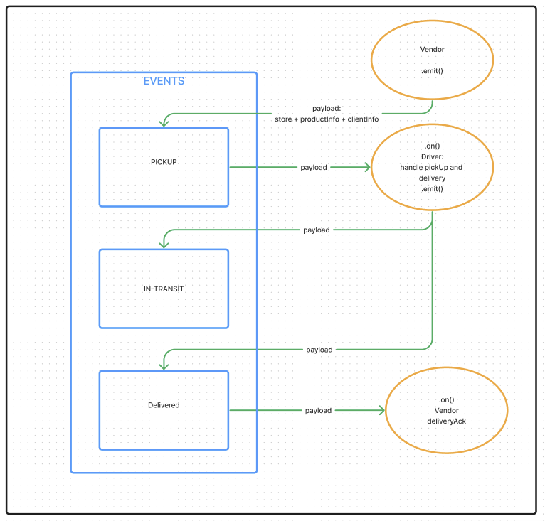
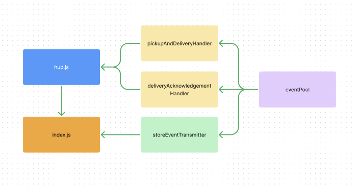

# Lab - 401 Class 11

## Project: CAP - The Code Academy Parcel Service

Build out a system that emulates a real world supply chain. CAPS will simulate a delivery service where vendors (such a flower shops) will ship products using our delivery service and when our drivers deliver them, each vendor will be notified that their customers received what they purchased.

This will be an event driven application that “distributes” the responsibility for logging to separate modules, using only events to trigger logging based on activity.

### Author: Melo

### Problem Domain

Objective:  
Setup a pool of events and handler functions, with the intent being to refactor parts of the system throughout the week, but keep the handlers themselves largely the same. The task of “delivering a package” doesn’t change (the handler), even if the mechanism for triggering that task (the event) does.

### Links and Resources

- [Pull Request](placeholder)
- [GitHub Actions ci/cd](placeholder)
- Prod [back-end server url](placeholder)

### Collaborators

### Setup

#### `.env` requirements (where applicable)

placeholder

#### How to initialize/run your application (where applicable)

- e.g. `npm start`

#### How to use your library (where applicable)

#### Features / Routes

- Feature One: Deploy as prod branch once all tests pass.

#### Tests

- How do you run tests?
  - jest

- Any tests of note?  
  - pickupAndDeliveryHandler.test.js
  - deliveryAcknowledgement.test.js

#### UML

#### File Structure

