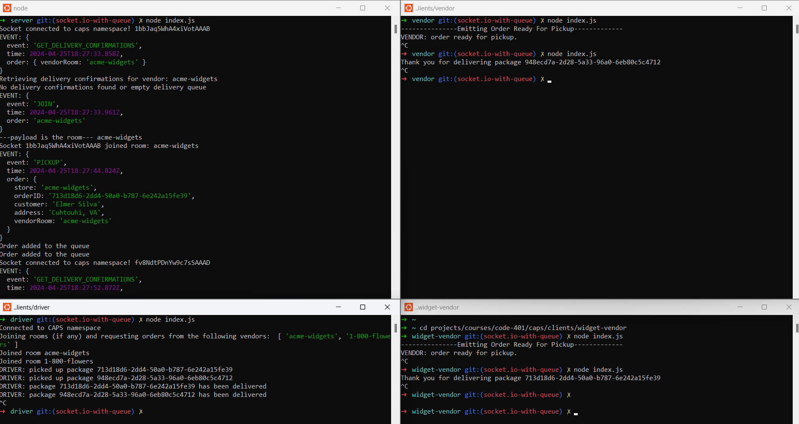

# Lab - 401 Class 12 - Phase 3

## Project: CAP - The Code Academy Parcel Service

Build out a system that emulates a real world supply chain. CAPS will simulate a delivery service where vendors (such a flower shops) will ship products using our delivery service and when our drivers deliver them, each vendor will be notified that their customers received what they purchased.

This will be an event driven application that “distributes” the responsibility for logging to separate modules, using only events to trigger logging based on activity.

### Author: Melo

### Problem Domain - Phase 3 - Message Queues

Objective:  
CAPS Phase 3: Complete work on a multi-day build of delivery tracking system, adding queued delivery.

In this phase, implement a system to guarantee that notification payloads are read by their intended subscriber. Rather than just triggering an event notification and hope that client applications respond, implement a “Queue” system so that nothing gets lost. Every event sent will be logged and held onto by the server until the intended recipient acknowledges that they received the message. At any time, a subscriber can get all of the messages they might have missed.

In this final phase, will be implementing a “Queue” feature on the Server, allowing Driver and Vendor clients to subscribe to messages added for pickup and delivered events within their respective client queue.

### Links and Resources

- [Pull Request](https://github.com/MelodicXP/caps/pull/5)
- [GitHub Actions ci/cd](https://github.com/MelodicXP/caps/actions)

### Collaborators

### Setup

#### `.env` requirements (where applicable)

NAMESPACE_URL='yourURL/caps'

#### How to initialize/run your application (where applicable)

- e.g. node index.js on each file, start in this order:  

        1. server
        2. driver
        3. vendor

#### How to use your library (where applicable)

#### Features / Routes

- Feature One: Deploy as prod branch once all tests pass.

#### Tests

- How do you run tests?
  - jest

- Any tests of note?  
  - pickupAndDeliveryHandler.test.js
  - deliveryAcknowledgement.test.js
  - eventEmitter.test.js

#### UML

#### File Structure

#### Terminal outputs

